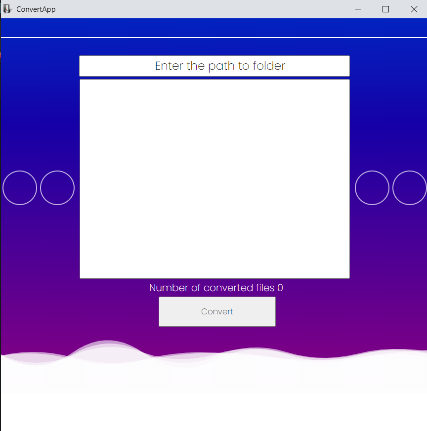

# ConvertApp
Video convertation app was created with python using [python-eel](https://github.com/python-eel/Eel). It allows you to convert all -mov files
from parrent folder to -mp4 files into new child folder.

## About app:
* Conversion functionality was made using microsoft cross platform [ffmpeg](https://ffmpeg.org/) library.
*  Web interface was made by simple HTML, CSS and JavaScript.

# Versions:
## V1 - present:
* Convert logic writen using python
* Web - HTML, CSS, JavaScript

## V2 - in production:
* Convert logic will be rewroten using [react-ffmpeg](https://www.npmjs.com/package/react-ffmpeg) library
* Web - will be rewriten to JavaScript using React
* New optional functionality will be added
